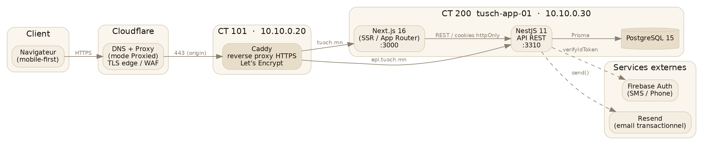
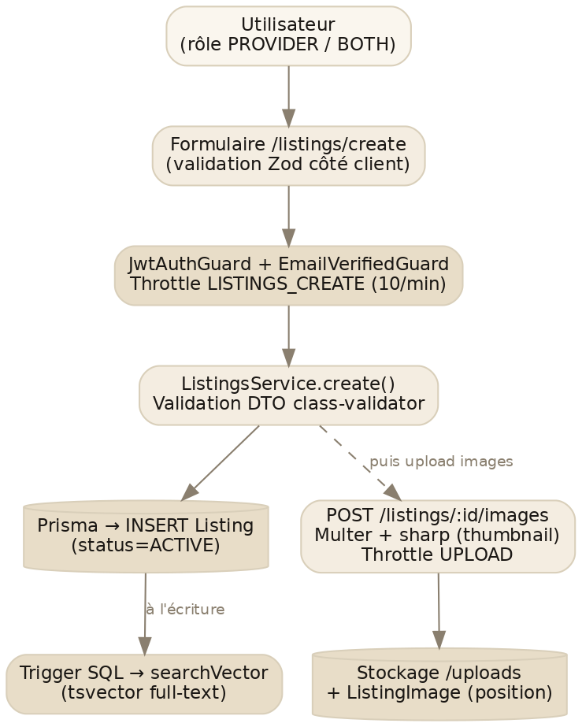
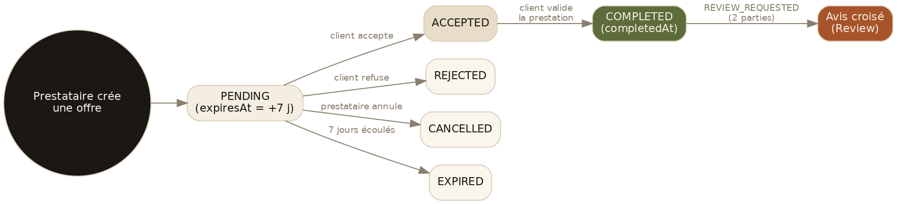
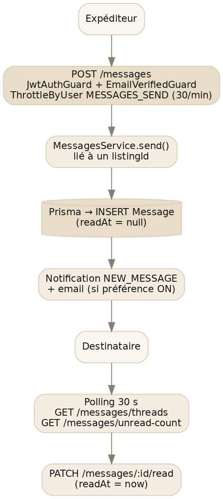

# Chapitre 2 — Architecture technique

## 2.1 Vue d'ensemble du monorepo

Le projet est un **monorepo** géré par **pnpm workspaces** et orchestré par **Turborepo** (`turbo.json`). Trois espaces de travail sont actifs :

| Workspace | Rôle | Stack principale |
|-----------|------|------------------|
| `apps/api` | Backend / API REST | NestJS 11, Prisma 6, PostgreSQL 15, JWT, Firebase Admin, Resend |
| `apps/web` | Frontend | Next.js 16 (App Router), React 19, TailwindCSS 4, TanStack Query, NextAuth |
| `packages/shared` | Code partagé | Types TypeScript, schémas Zod, énumérations, constantes (catégories, villes, notifications, téléphone) |

Les deux applications importent le code commun via l'alias de package `@repo/shared`. Le partage de types et de schémas entre back et front garantit la cohérence des contrats (par exemple les énumérations `UserRole`, `OfferStatus`, ou les helpers de normalisation de numéro de téléphone).

Les scripts racine standardisent les commandes transverses :

```bash
pnpm dev          # turbo dev — lance web + api
pnpm -w lint      # lint sur tous les workspaces
pnpm -w typecheck # typecheck api + web + shared
pnpm -w build     # build complet
pnpm smoke        # build + e2e api + unit api
```

> **Versions clés** (relevées dans les `package.json`) : Node 22 (cible Volta 24), pnpm 8.15.6, TypeScript 5.9 (mode strict partout), Next.js 16.1.2, React 19.2.3, NestJS 11.1, Prisma 6.19, PostgreSQL 15, TailwindCSS 4.1, next-intl 4.8, next-auth 4.24, firebase-admin 13.10, Resend 6.12.
>
> **Point de vigilance connu** : Zod est en version 3 côté API (`zod@3.25`) et version 4 côté web (`zod@4.3`). Tant que les schémas Zod réellement *partagés* via `@repo/shared` restent limités, l'impact est faible, mais l'alignement de version est une dette à traiter (voir §10.6).

## 2.2 Diagramme global d'architecture

Le parcours d'une requête, du navigateur jusqu'à la base de données, traverse les couches suivantes : le client mobile ou desktop atteint Cloudflare (DNS + proxy + TLS de bordure), qui transmet au reverse proxy Caddy hébergé dans le conteneur CT 101 ; Caddy route ensuite vers l'application (CT 200), où coexistent le frontend Next.js et l'API NestJS, cette dernière dialoguant avec PostgreSQL via Prisma et avec les services externes Firebase et Resend.



*Fig. 2.1 — Architecture globale. Détails de l'infrastructure d'hébergement au chapitre 8.*

## 2.3 Choix techniques justifiés

| Choix | Pourquoi | Compromis / inconvénient |
|-------|----------|--------------------------|
| **Monorepo pnpm + Turbo** | Partage de types front/back sans publication de package ; un seul `pnpm install` ; cache de build incrémental | Couplage des versions ; outillage monorepo à maîtriser |
| **NestJS (API)** | Architecture modulaire imposée, injection de dépendances, intégration native de la validation (class-validator), des guards et de Swagger | Verbosité (DTO, modules, décorateurs) |
| **Prisma (ORM)** | Schéma typé, migrations versionnées, client TypeScript généré ; échappatoire `$queryRaw` pour le SQL avancé (tsvector) | `tsvector` non typé nativement (`Unsupported`), abstraction parfois contraignante |
| **PostgreSQL 15** | Recherche plein-texte native (tsvector), JSONB (préférences email), robustesse, gratuité | Nécessite un tuning pour les performances à l'échelle |
| **Next.js 16 App Router** | Server Components par défaut (moins de JS côté client), SEO, rendu rapide, `next/image` | Modèle mental Server/Client à maîtriser ; quelques API en évolution |
| **TanStack Query** | Cache, invalidation, états de chargement/erreur côté client sans boilerplate | Une couche de plus à comprendre |
| **JWT en cookie httpOnly** | Pas de token accessible au JS (anti-XSS), session simple sans store serveur | Révocation moins fine qu'une session en base ; rotation à gérer |
| **Firebase Phone Auth** | SMS/OTP délégués à un service éprouvé, pas de gateway SMS à opérer | Dépendance externe ; quota et configuration reCAPTCHA |
| **Resend (email)** | 3 000 emails/mois gratuits, templates React Email, bonne délivrabilité | Dépendance externe ; plafonds du palier gratuit |
| **Caddy (reverse proxy)** | HTTPS automatique (Let's Encrypt), configuration minimale | Moins répandu que Nginx dans les équipes |

## 2.4 Diagrammes de flux principaux

### Publication d'une annonce

La création d'une annonce passe le double guard `JwtAuthGuard` + `EmailVerifiedGuard` (un email vérifié est requis pour publier), avec un *throttle* dédié. Le service valide le DTO puis insère via Prisma ; le `searchVector` (tsvector) est alimenté à l'écriture. Les images sont ensuite envoyées sur un endpoint séparé, traitées par `sharp` (génération de *thumbnail*) et stockées sur disque, chaque `ListingImage` portant une position.



*Fig. 2.2 — Publication d'une annonce et upload d'images.*

### Cycle de vie d'une offre

Une offre naît à l'état `PENDING` avec une expiration fixée à 7 jours. Le demandeur (propriétaire de l'annonce) peut l'accepter ou la refuser ; le prestataire peut l'annuler ; passé le délai, elle expire. Une offre `ACCEPTED` devient `COMPLETED` lorsque le demandeur valide la prestation, ce qui déclenche une demande d'avis croisée aux deux parties.



*Fig. 2.3 — Machine à états d'une offre (PENDING → … → COMPLETED → avis).*

Les transitions sont protégées côté service : seul le propriétaire de l'annonce peut accepter/refuser/compléter (`OfferOwnershipGuard` + vérification métier), et chaque transition vérifie l'état de départ (par exemple « seules les offres acceptées peuvent être complétées »).

### Messagerie

L'envoi d'un message exige un email vérifié et est limité par un *throttle* par utilisateur (30/min). Chaque message est rattaché à une annonce (`listingId`). À l'écriture, une notification `NEW_MESSAGE` est créée et un email est éventuellement envoyé (selon la préférence du destinataire). Le destinataire récupère ses fils de discussion et son compteur de non-lus par polling (~30 s), et marque les messages comme lus.



*Fig. 2.4 — Messagerie 1-to-1 rattachée à une annonce.*

### Authentification (3 méthodes)

Les trois méthodes d'authentification (email/mot de passe, téléphone Firebase, OAuth Google) convergent toutes vers la même session : un JWT signé déposé dans un cookie `httpOnly`. Le détail de chaque flux est traité au chapitre 6.

## 2.5 Patterns architecturaux

L'API suit un pattern **Controller → Service → Prisma** sans couche *repository* intermédiaire :

- Le **contrôleur** ne fait que de l'orchestration HTTP : décorateurs de route, guards, validation du DTO (via le `ValidationPipe` global avec `whitelist: true` et `transform: true`), extraction de l'utilisateur authentifié, et délégation au service. Il ne contient pas de logique métier.
- Le **service** porte toute la logique métier et accède directement à la base via `PrismaService` (injecté). C'est aussi là que sont orchestrés les effets de bord (notification, email).
- **`PrismaService`** centralise l'accès à PostgreSQL ; pour le SQL avancé (recherche plein-texte), les services utilisent `prisma.$queryRaw` avec des fragments `Prisma.sql` paramétrés (anti-injection).

Ce choix privilégie la simplicité : pas d'abstraction de persistance superflue pour un MVP, mais une frontière nette entre HTTP (contrôleur) et métier (service).

### Éléments transverses (`common/`)

| Élément | Rôle |
|---------|------|
| `RequestIdMiddleware` | Attribue un identifiant de requête (corrélation des logs) |
| `LoggingInterceptor` | Log structuré des requêtes + alimentation des métriques |
| `GlobalExceptionFilter` | Format d'erreur homogène |
| `ThrottlerExceptionFilter` | Réponse normalisée en cas de dépassement de quota |
| `CustomThrottlerGuard` | Rate limiting (désactivé en environnement de test) |
| Guards (`JwtAuthGuard`, `AdminGuard`, `RolesGuard`, `OwnershipGuard`, `EmailVerifiedGuard`, `OptionalJwtAuthGuard`) | Authentification et autorisation (voir chapitre 6) |

## 2.6 Communication frontend ↔ backend

- **Protocole.** REST sur JSON. L'API préfixe ses réponses d'un `Content-Type: application/json; charset=utf-8` pour garantir le rendu correct du cyrillique.
- **Authentification.** Le frontend ne stocke jamais le JWT en clair : à la connexion, l'API dépose un cookie `httpOnly` `accessToken` (voir §6.6). Les appels authentifiés transmettent ce cookie (`credentials: 'include'`), et le serveur lit l'identité via `JwtAuthGuard`. CORS est configuré avec `credentials: true` et une origine explicite (`CORS_ORIGIN`).
- **Couche de données côté client.** **TanStack Query** (React Query) gère le cache, l'invalidation et les états de chargement/erreur. Les appels réseau passent par une couche d'helpers `lib/api/*.ts` (un fichier par domaine), au-dessus d'un client de base commun (`lib/api/base.ts`).
- **OAuth.** Le handshake OAuth est géré côté Next.js par **NextAuth** (`/api/auth`), puis un composant `AuthSync` échange le profil OAuth contre une session backend (cookie JWT) via `POST /auth/oauth-login` (voir §6.3).
- **Documentation interactive.** L'API expose **Swagger** sur `/api/docs` (la racine `/` redirige vers cette page), ce qui sert de contrat vivant pour le frontend et les intégrations.
