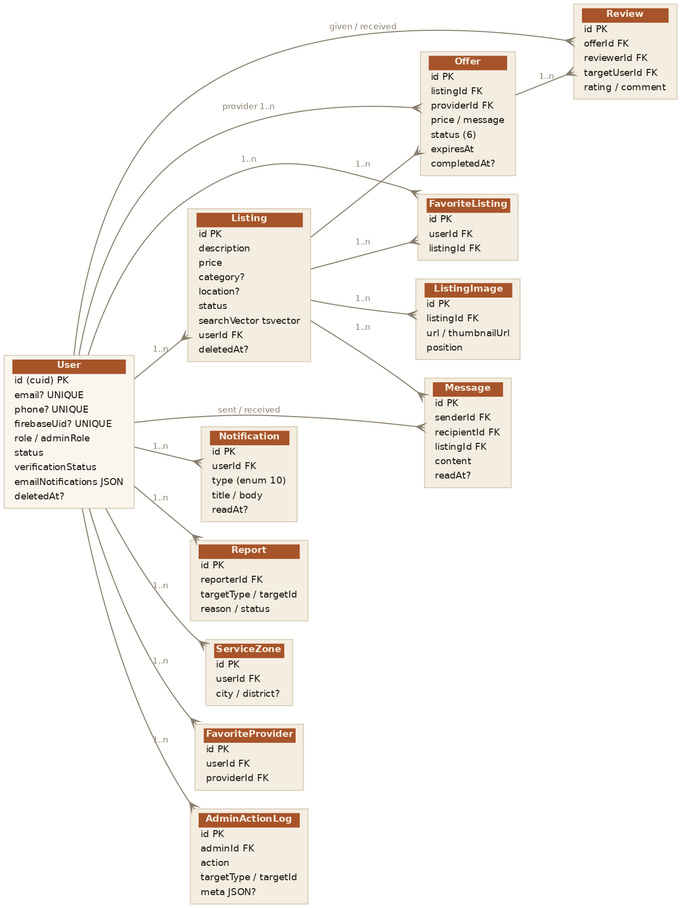

# Chapitre 3 — Base de données

## 3.1 PostgreSQL : version, configuration, encodage, recherche plein-texte

La base de données est **PostgreSQL 15**. En développement et en CI elle tourne via l'image `postgres:15` ; en production elle est installée directement dans le conteneur applicatif CT 200 (voir chapitre 8). L'accès se fait exclusivement via Prisma (`provider = "postgresql"`, `url = env("DATABASE_URL")`).

**Encodage.** La base est en UTF-8, condition nécessaire au stockage du mongol cyrillique. La chaîne entière (client Prisma, API, en-têtes HTTP) est cohérente en UTF-8.

**Recherche plein-texte.** Le modèle `Listing` porte une colonne `searchVector` de type `tsvector` (déclarée `Unsupported("tsvector")?` côté Prisma car le type n'est pas nativement supporté). La recherche utilise `plainto_tsquery('simple', …)` et le classement `ts_rank`. La configuration **`'simple'`** est choisie volontairement : les configurations linguistiques (`'english'`, etc.) appliquent un *stemming* inadapté au mongol, alors que `'simple'` se contente de normaliser et découper en *tokens*, ce qui fonctionne pour le cyrillique. Le détail de l'implémentation est en §4.3 (module listings) et ci-dessous en §3.5 (migration `add_fulltext_search`).

**Soft delete.** Les modèles `User` et `Listing` ne sont jamais supprimés physiquement dans les flux normaux : ils portent un champ `deletedAt` (nullable) indexé, et les requêtes filtrent sur `deletedAt: null`.

## 3.2 Diagramme entité-relation



*Fig. 3.1 — Modèle de données. `User` est l'entité centrale ; les relations sont en grande majorité `1..n` avec suppression en cascade vers les entités dépendantes.*

## 3.3 Schéma Prisma annoté

Le schéma compte **12 modèles**. Tous utilisent un identifiant `cuid()` en clé primaire et des timestamps `createdAt` / `updatedAt` (sauf exceptions notées).

### User

Entité centrale. Porte l'identité, les trois facteurs d'authentification, le rôle métier et administratif, l'état KYC et les préférences.

| Champ | Type | Contrainte / note |
|-------|------|-------------------|
| `id` | String | PK, `cuid()` |
| `email` | String? | **UNIQUE**, nullable (un compte téléphone peut ne pas avoir d'email) |
| `password` | String? | Hash bcrypt ; nullable (comptes téléphone) |
| `firstName` / `lastName` | String | Requis |
| `phone` | String? | **UNIQUE**, format E.164 `+976…` |
| `phoneVerified` / `phoneVerifiedAt` | Boolean / DateTime? | Vérification téléphone |
| `firebaseUid` | String? | **UNIQUE**, identité Firebase liée |
| `accountType` | String | Champ libre hérité (« client », « basic »…) |
| `role` | `UserRole` | `CLIENT` par défaut |
| `isAdmin` / `adminRole` | Boolean / `AdminRole` | Administration |
| `status` | `UserStatus` | `ACTIVE` par défaut |
| `avatarUrl` | String? | Chemin `/uploads/avatars/…` |
| `emailVerified` / `emailVerifiedAt` | Boolean / DateTime? | Vérification email |
| `emailVerifyToken` / `…Exp` | String? (UNIQUE) / DateTime? | Token de vérification haché (SHA-256) + expiration |
| `resetToken` / `resetTokenExp` | String? (UNIQUE) / DateTime? | Token de reset mot de passe haché + expiration |
| `onboardingCompletedAt` | DateTime? | Fin d'onboarding |
| `acceptedTermsAt` | DateTime? | Acceptation des CGU |
| `verificationStatus` | `VerificationStatus` | KYC, `NOT_SUBMITTED` par défaut |
| `verificationDocumentUrl` / `verificationRejectedReason` / `verifiedAt` | String? / String? / DateTime? | Pièces KYC |
| `bio` / `city` | String? | Profil |
| `emailNotifications` | Json | Préférences email (défaut `{}`, voir §7.5) |
| `serviceCategories` / `serviceZones` | String[] | Catégories et zones (dénormalisées) |
| `deletedAt` | DateTime? | Soft delete |

**Indexes** : `deletedAt`, `phone`, `firebaseUid`.
**Relations** : `Listing[]`, `Message[]` (envoyés/reçus), `Review[]` (donnés/reçus), `AdminActionLog[]`, `Notification[]`, `Report[]`, `Offer[]`, `FavoriteListing[]`, `FavoriteProvider[]` (favoris + favorisé par), `ServiceZone[]`.

**Champs jamais exposés par l'API** (retirés par `sanitizeUser()`) : `password`, `resetToken`, `resetTokenExp`, `emailVerifyToken`, `emailVerifyTokenExp`, `firebaseUid`.

### Listing

Annonce / demande de service.

| Champ | Type | Note |
|-------|------|------|
| `id` | String | PK |
| `description` | String | Texte de la demande (sert aussi de « titre » via les 60 premiers caractères) |
| `price` | Int | Prix indicatif (en MNT) |
| `location` | String? | Ville / lieu |
| `category` | String? | Slug de catégorie (voir §1.5) |
| `status` | `ListingStatus` | `ACTIVE` / `HIDDEN` |
| `searchVector` | `tsvector`? | Recherche plein-texte (alimenté en base) |
| `userId` | String | FK → User (cascade) |
| `deletedAt` | DateTime? | Soft delete |

**Indexes** : `userId`, `deletedAt`.
**Relations** : `images ListingImage[]`, `message Message[]`, `offers Offer[]`, `favoritedBy FavoriteListing[]`.

### ListingImage

Image d'une annonce, ordonnée.

| Champ | Type | Note |
|-------|------|------|
| `id` | String | PK |
| `listingId` | String | FK → Listing (cascade) |
| `url` | String | Image originale |
| `thumbnailUrl` | String? | Miniature (sharp) |
| `position` | Int | Ordre d'affichage |

**Contrainte** : `@@unique([listingId, position])`. **Index** : `listingId`.

### Offer

Offre d'un prestataire sur une annonce. Machine à états (voir §2.4).

| Champ | Type | Note |
|-------|------|------|
| `id` | String | PK |
| `listingId` | String | FK → Listing (cascade) |
| `providerId` | String | FK → User (cascade) |
| `price` | Int | Montant proposé |
| `message` | String | Message d'accompagnement |
| `estimatedDays` | Int? | Délai estimé |
| `status` | `OfferStatus` | `PENDING` par défaut |
| `expiresAt` | DateTime | Création + 7 jours |
| `respondedAt` | DateTime? | Horodatage accept/refus |
| `completedAt` | DateTime? | Horodatage complétion |
| `clientNote` | String? | Note du client à la complétion |

**Contrainte** : `@@unique([listingId, providerId])` — un prestataire ne peut avoir qu'une offre par annonce. **Indexes** : `providerId`, `(listingId, status)`. **Relations** : `reviews Review[]`.

### Review

Avis lié à une offre complétée.

| Champ | Type | Note |
|-------|------|------|
| `id` | String | PK |
| `offerId` | String | FK → Offer (cascade) |
| `targetUserId` | String | Utilisateur noté (cascade) |
| `reviewerId` | String | Auteur de l'avis (cascade) |
| `rating` | Int | Note 1–5 |
| `comment` | String | Commentaire |

**Contrainte** : `@@unique([reviewerId, offerId])` — un seul avis par auteur et par offre. **Indexes** : `targetUserId`, `offerId`.

### Message

Message 1-to-1 rattaché à une annonce.

| Champ | Type | Note |
|-------|------|------|
| `id` | String | PK |
| `senderId` / `recipientId` | String | FK → User (cascade) |
| `listingId` | String | FK → Listing |
| `content` | String | Contenu |
| `readAt` | DateTime? | Null tant que non lu |

**Indexes** : `(senderId, recipientId, createdAt)`, `(recipientId, readAt)` — optimisés pour les fils de discussion et le compteur de non-lus.

### Notification

Notification in-app.

| Champ | Type | Note |
|-------|------|------|
| `id` | String | PK |
| `userId` | String | FK → User (cascade) |
| `type` | `NotificationType` | 10 valeurs (voir §3.4) |
| `title` / `body` | String | Texte rendu |
| `readAt` | DateTime? | Null tant que non lu |

**Index** : `(userId, readAt, createdAt)`.

### Report

Signalement de contenu ou d'utilisateur.

| Champ | Type | Note |
|-------|------|------|
| `id` | String | PK |
| `reporterId` | String | FK → User (cascade) |
| `targetType` | `ReportTargetType` | `LISTING` / `USER` |
| `targetId` | String | Cible du signalement |
| `reason` | `ReportReason` | `SPAM` / `INAPPROPRIATE` / `FRAUD` / `OTHER` |
| `description` | String? | Précision libre |
| `status` | `ReportStatus` | `PENDING` par défaut |
| `reviewedAt` / `reviewedBy` | DateTime? / String? | Traitement admin |

**Indexes** : `(status, targetType, createdAt)`, `(reporterId, targetType, targetId, status)`.

### ServiceZone

Zone géographique d'un prestataire.

| Champ | Type | Note |
|-------|------|------|
| `id` | String | PK |
| `userId` | String | FK → User (cascade) |
| `city` | String | Ville |
| `district` | String? | District optionnel |

**Index** : `(userId, city)`.

### FavoriteListing / FavoriteProvider

Favoris. Deux modèles distincts (annonce vs prestataire), même structure.

| Champ | Type | Note |
|-------|------|------|
| `id` | String | PK |
| `userId` | String | FK → User (cascade) |
| `listingId` *(FavoriteListing)* / `providerId` *(FavoriteProvider)* | String | Cible (cascade) |

**Contraintes** : `@@unique([userId, listingId])` / `@@unique([userId, providerId])`. **Index** : `userId`.

### AdminActionLog

Journal d'audit des actions d'administration (voir §6.7).

| Champ | Type | Note |
|-------|------|------|
| `id` | String | PK |
| `adminId` | String | FK → User |
| `action` | String | Code d'action (ex. `PHONE_LOGIN`, `PHONE_LINK`) |
| `targetType` | String | Type de cible |
| `targetId` | String? | Cible |
| `meta` | Json? | Métadonnées contextuelles |

**Indexes** : `adminId`, `(targetType, targetId)`. *Note : ce modèle n'a que `createdAt` (pas d'`updatedAt`).*

### Exemple d'utilisation (Prisma)

```ts
// Récupérer une annonce active avec ses images ordonnées et l'auteur
const listing = await prisma.listing.findFirst({
  where: { id, deletedAt: null, status: 'ACTIVE' },
  include: {
    images: { orderBy: { position: 'asc' } },
    user: { select: { id: true, firstName: true, lastName: true, avatarUrl: true } },
  },
});
```

## 3.4 Énumérations

Le schéma définit **9 énumérations** (alignées sur `packages/shared/src/enums.ts`).

| Enum | Valeurs | Signification |
|------|---------|---------------|
| `UserRole` | `CLIENT`, `PROVIDER`, `BOTH` | Rôle métier de l'utilisateur |
| `AdminRole` | `USER`, `MODERATOR`, `ADMIN` | Niveau d'administration |
| `UserStatus` | `ACTIVE`, `SUSPENDED` | État du compte |
| `ListingStatus` | `ACTIVE`, `HIDDEN` | Visibilité de l'annonce (masquage par modération) |
| `OfferStatus` | `PENDING`, `ACCEPTED`, `REJECTED`, `EXPIRED`, `CANCELLED`, `COMPLETED` | États de l'offre |
| `NotificationType` | `NEW_MESSAGE`, `NEW_REVIEW`, `NEW_OFFER`, `OFFER_ACCEPTED`, `OFFER_REJECTED`, `LISTING_HIDDEN`, `ACCOUNT_SUSPENDED`, `REVIEW_REQUESTED`, `IDENTITY_VERIFIED`, `IDENTITY_REJECTED` | Type de notification (10 valeurs) |
| `ReportTargetType` | `LISTING`, `USER` | Cible d'un signalement |
| `ReportReason` | `SPAM`, `INAPPROPRIATE`, `FRAUD`, `OTHER` | Motif de signalement |
| `ReportStatus` | `PENDING`, `REVIEWED`, `DISMISSED` | Traitement du signalement |
| `VerificationStatus` | `NOT_SUBMITTED`, `PENDING`, `VERIFIED`, `REJECTED` | État de la vérification KYC |

## 3.5 Migrations historiques

La base compte **35 migrations** Prisma, de `20250523101710_init` (mai 2025) à `20260520150000_add_email_notification_preferences` (mai 2026). Les migrations marquent assez fidèlement la construction fonctionnelle du produit.

| Date | Migration | Impact |
|------|-----------|--------|
| 2025-05-23 | `init`, `rename_table` | Schéma initial (User) |
| 2025-06 | `add_password_to_user`, `add_user_fields` | Auth email/mot de passe |
| 2025-11 | `init_listing`, `add_user_listing_relation` | Annonces |
| 2025-12 | `avatar_url`, `add_listing_category`, `add_listing_images`, `remove_listing_title` | Profil + images + catégories |
| 2025-12-31 | `add_messqges`, `relation_message_and_listing` | Messagerie *(sic : faute de frappe « messqges » dans le nom de migration)* |
| 2026-01 | `add_user_role`, `admin_moderation`, `add_reviews` | Rôles, modération, avis |
| 2026-02 | `reset_token_in_user`, `added_email_verified_in_user`, `add_notifications`, `add_soft_deletes`, `add_reports_system`, `add_thumbnail_url`, `add_offers`, `add_offer_response_notifications`, `add_favorites`, `add_offer_completed` | Reset/verify email, notifications, soft delete, signalements, thumbnails, **offres**, favoris |
| 2026-03 | `add_admin_role`, `add_onboarding_fields`, `add_review_offer_link`, `add_kyc_verification`, `add_service_zones` | `AdminRole`, onboarding, lien avis↔offre, KYC, zones |
| 2026-04 | `add_fulltext_search`, `add_accepted_terms` | **Recherche plein-texte (tsvector)**, CGU |
| 2026-05-20 | `add_phone_auth_fields`, `add_email_notification_preferences` | Champs Firebase/phone (US-A1), préférences email JSON (US-E3) |

**Migrations structurantes à connaître :**

- `add_fulltext_search` — ajoute la colonne `searchVector` (tsvector), un index GIN et un *trigger* d'alimentation. C'est cette migration qui rend possible la recherche cyrillique classée par pertinence.
- `add_soft_deletes` — introduit `deletedAt` et le pattern de suppression logique.
- `add_offers` + `add_review_offer_link` — modélisent le cœur transactionnel (offre → complétion → avis lié à l'offre).
- `add_phone_auth_fields` — ajoute `phone`, `phoneVerified`, `firebaseUid` et leurs index/unicités.

## 3.6 Stratégie de seed et données de référence

Deux notions distinctes coexistent :

**1. Données de référence (constantes applicatives, pas en base).** Les 8 catégories de service (`packages/shared/src/categories.ts`) et les villes/districts mongols (`packages/shared/src/data/mn-locations`) sont des **constantes du package partagé**, pas des tables. Elles sont importées directement par le front et l'API. Avantage : pas de jointure ni de seed pour des référentiels stables ; le slug de catégorie est simplement stocké en texte sur `Listing.category`.

**2. Seed de test (`apps/api/prisma/seed.ts`).** Le script de seed est dédié à la **validation de la recherche plein-texte cyrillique** (US-44). Il est idempotent : il crée (en `upsert`) un utilisateur stable `seed@tusch.mn` et 8 annonces en mongol couvrant les 8 catégories (Улаанбаатар, Дархан, Эрдэнэт…). Il se lance via :

```bash
pnpm -C apps/api prisma db seed
```

> **À noter** : il n'existe pas de seed de données de production (utilisateurs, annonces réelles). Le seed est uniquement un outil de développement/validation.
