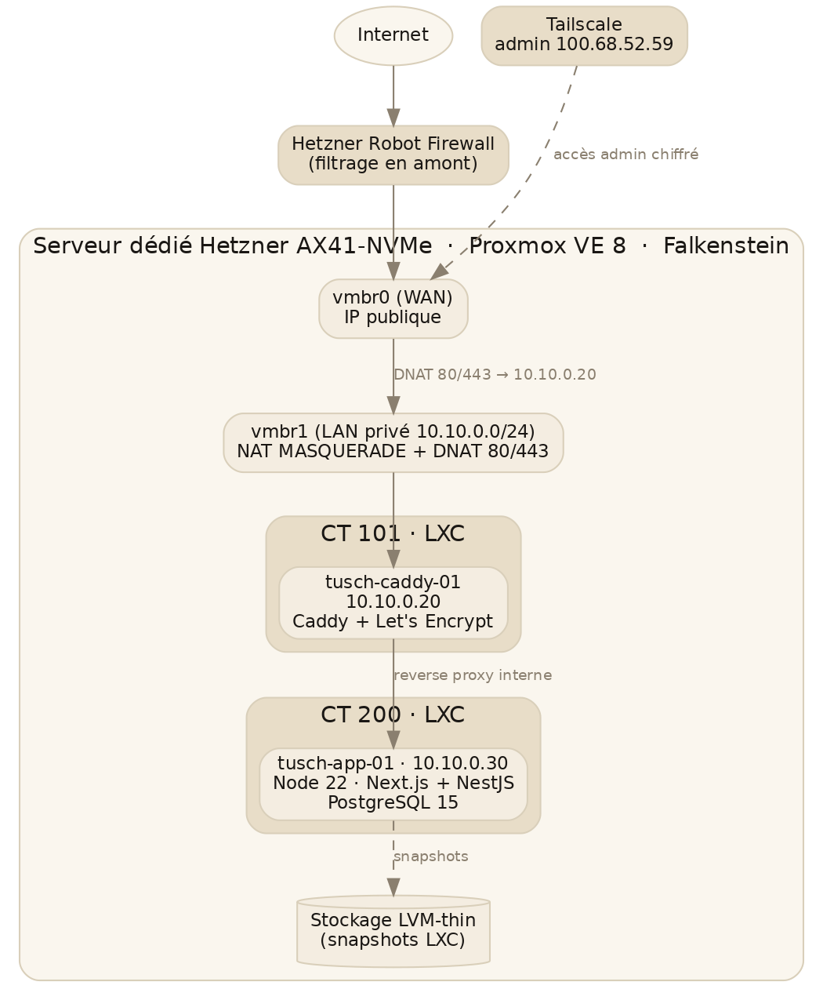

# Chapitre 8 — Infrastructure (Hetzner + Proxmox)

> Ce chapitre est une **vue d'ensemble** de l'infrastructure d'hébergement. La procédure d'installation pas-à-pas, les commandes exactes et l'historique des incidents sont documentés en détail dans le document séparé **« Tusch Infra — Documentation Technique » (Darkhansukh, v1.0)**. En cas de divergence, ce document infra fait foi pour les détails opérationnels.

## 8.1 Serveur dédié Hetzner AX41-NVMe

Le projet est hébergé sur un **serveur dédié Hetzner AX41-NVMe**, commandé via Server Auction (meilleur ratio prix/performance après comparaison avec OVH, Scaleway, Vultr, Cherry Servers).

| Caractéristique | Valeur |
|-----------------|--------|
| CPU | AMD Ryzen 5 3600 — 6 cœurs / 12 threads @ 3,6 GHz |
| RAM | 64 Go DDR4 (2 × 32 Go) |
| Disques | 2 × 512 Go NVMe M.2, **RAID 1 logiciel (mdadm)** |
| Datacenter | FSN1-DC7, Falkenstein (Allemagne) |
| Trafic | Illimité, 1 Gbit/s |
| Prix | ≈ 44,70 € HT/mois, 0 € de setup |
| IP publique | 157.90.35.170 |
| Hostname Proxmox | tusch-pve-01 |

**Budget mensuel total** (sous l'objectif de 100 €) : ≈ **65 €/mois** — serveur 44,70 € + Hetzner Storage Box 1 To 4 € + Microsoft 365 Business Basic ×2 12 € + Cloudflare Free 0 € + Tailscale Free 0 € + domaine tusch.mn (annualisé) 4 €.

## 8.2 Proxmox VE 8

L'hyperviseur est **Proxmox VE 8.4** (édition community), installé manuellement par-dessus une base **Debian 12 (Bookworm)** déployée via `installimage`. Le dépôt **enterprise est désactivé** au profit du dépôt **no-subscription**. Les **mises à jour automatiques** sont activées (`unattended-upgrades`) avec **reboot automatique à 04 h** en cas de mise à jour du noyau. Le noyau actif est `6.8.12-23-pve`.

## 8.3 Architecture LXC

L'application tourne dans des **conteneurs LXC** (légers, à la différence de VMs KVM réservées au lab Windows). Deux conteneurs sont pertinents pour tusch.mn :

| CT | Hostname | IP (vmbr1) | Rôle | Ressources |
|----|----------|-----------|------|------------|
| 101 | tusch-caddy-01 | 10.10.0.20/24 | Reverse proxy Caddy (HTTPS) | 1 cœur, 512 Mo, 8 Go disque, *unprivileged*, firewall on |
| 200 | tusch-app-01 | 10.10.0.30/24 | Runtime app (Node 22 + PostgreSQL 15) | 4 vCPU, 8 Go RAM, 50 Go disque |

CT 200 est cloné d'un template Debian 12 (CT 900). **Plan d'adressage** vmbr1 : `10.10.0.1` = gateway (host), `10.10.0.20` = Caddy, `10.10.0.30+` = applications.



*Fig. 8.1 — Topologie d'hébergement (réseau, conteneurs, accès admin).*

## 8.4 Réseau Proxmox

Deux *bridges* Linux sont configurés dans `/etc/network/interfaces` :

- **vmbr0 (WAN)** : porte l'IP publique `157.90.35.170/26` (gateway `157.90.35.129`). L'interface physique `enp35s0` en est l'esclave (sans IP).
- **vmbr1 (LAN privé)** : `10.10.0.1/24`, gateway des conteneurs.

Les conteneurs sortent vers Internet via **NAT MASQUERADE** (`iptables -t nat -A POSTROUTING -s 10.10.0.0/24 -o vmbr0 -j MASQUERADE`), précédé de l'activation de l'IP forwarding. Une **règle obligatoire spécifique à Proxmox** (`iptables -t raw -I PREROUTING -i fwbr+ -j CT --zone 1`) est nécessaire dès que le firewall PVE est actif sur un conteneur : sans elle, le mini-bridge `fwbrXXX` inséré par Proxmox brouille le *conntrack* et le NAT ne s'applique pas (piège documenté, source : wiki Proxmox Network Configuration).

Le **port forwarding** du trafic public 80/443 vers Caddy se fait par **DNAT** dans la section vmbr0 :

```
iptables -t nat -A PREROUTING -i vmbr0 -p tcp --dport 80  -j DNAT --to-destination 10.10.0.20:80
iptables -t nat -A PREROUTING -i vmbr0 -p tcp --dport 443 -j DNAT --to-destination 10.10.0.20:443
```

## 8.5 Défense en profondeur (5 couches)

| # | Couche | Mécanisme |
|---|--------|-----------|
| 1 | **Hetzner Robot Firewall** | Filtrage en amont (réseau Hetzner), avant que les paquets atteignent le serveur. Économise CPU et logs. SSH (22) ouvert, Proxmox UI (8006) **fermé** au public. |
| 2 | **SSH hardening** | Authentification par **clé uniquement** (`PasswordAuthentication no`, `PermitRootLogin prohibit-password`, `MaxAuthTries 3`), via un fichier *drop-in* `/etc/ssh/sshd_config.d/99-hardening.conf`. |
| 3 | **fail2ban** | Bannissement dynamique des IP après 3 tentatives échouées (nécessite `python3-systemd` pour lire le journal). |
| 4 | **Tailscale** | Canal d'administration privé (VPN mesh). IP admin `100.68.52.59`. La plage Tailscale `100.64.0.0/10` est autorisée. |
| 5 | **Proxmox Datacenter Firewall** | Politique **DROP par défaut**, *Security Groups* réutilisables : `admin-access` (SSH + UI 8006 depuis l'IP perso `88.127.174.183`), `tailscale-access` (tout via `100.64.0.0/10`), `web-public` (80/443 depuis Internet). Activation en cascade Datacenter → Node → CT. |

À cela s'ajoute la **6ᵉ couche applicative** (rate limiting, RBAC, ownership guards) traitée au chapitre 6. La politique générale : *« ne jamais désactiver une méthode d'authentification sans avoir validé la nouvelle au préalable »*.

## 8.6 DNS Cloudflare

Le domaine `tusch.mn` est géré par **Cloudflare** (plan Free). Les *nameservers* `whois.com` ont été remplacés par **`fonzie.ns.cloudflare.com`** et **`sue.ns.cloudflare.com`**. Les enregistrements A (`tusch.mn`, `www`) pointent vers `157.90.35.170` et sont passés en **mode Proxied** (nuage orange) après validation HTTPS — l'IP réelle du serveur est ainsi masquée derrière les IP Cloudflare, avec CDN, WAF et protection DDoS inclus.

## 8.7 HTTPS Let's Encrypt via Caddy

Caddy obtient et renouvelle automatiquement un **certificat Let's Encrypt** (challenge HTTP-01) pour `tusch.mn` et `www.tusch.mn`. Côté Cloudflare, le mode de chiffrement est **Full (strict)**, avec *Always Use HTTPS*, TLS 1.2 minimum, TLS 1.3 activé et HSTS. Le test **SSL Labs donne un score A+**.

## 8.8 Configuration Caddy

Caddy 2 est installé via le dépôt apt Cloudsmith. Le `Caddyfile` applique des en-têtes de sécurité et journalise en JSON :

```caddy
tusch.mn, www.tusch.mn {
    respond "<HTML page coming soon>" 200
    header {
        Content-Type "text/html; charset=utf-8"
        Strict-Transport-Security "max-age=31536000; includeSubDomains"
        X-Content-Type-Options "nosniff"
        X-Frame-Options "SAMEORIGIN"
        Referrer-Policy "strict-origin-when-cross-origin"
    }
    log {
        output file /var/log/caddy/tusch.mn.log
        format json
    }
}
```

> **État actuel : page « coming soon ».** Au moment de la rédaction, Caddy sert une page d'attente et **n'est pas encore configuré en reverse proxy vers l'application** (CT 200). Le passage en `reverse_proxy` vers `10.10.0.30:3000` (web) et la création du sous-domaine `api.tusch.mn` vers l'API sont des étapes **à venir** (voir chapitre 9).

## 8.9 PostgreSQL 15 sur CT 200

PostgreSQL 15 est installé **directement dans le conteneur applicatif** CT 200 (pas dans un conteneur dédié), ce qui simplifie le MVP. Configuration :

- Utilisateur applicatif `tusch_app` (mot de passe stocké hors documentation).
- Deux bases : **`tusch_dev`** et **`tusch_prod`** (toutes deux *owned* par `tusch_app`).
- PostgreSQL n'écoute que sur `localhost:5432` — l'app tourne dans le même conteneur, aucune exposition réseau.

## 8.10 Stockage LVM-thin (snapshots LXC)

Le stockage Proxmox par défaut (`local`, type *dir* sur ext4) **ne supporte pas les snapshots LXC**, bloquant pour figer l'état d'un conteneur avant une opération risquée. Solution retenue : **LVM-thin sur fichier loopback** (ZFS et réinstallation complète ayant été écartés comme trop radicaux).

Principe : un fichier *sparse* de 200 Go (`/var/lib/vz/lvm-pool.img`) est attaché à `/dev/loop3`, sur lequel sont construits un VG (`vg_tusch`) et un *thin pool* LVM (`data`), déclaré à Proxmox comme storage `local-lvm` (type `lvmthin`). Un service systemd (`lvm-pool-loopback.service`) recrée le loopback et active le VG au démarrage, **avant** `pve-storage.target`. Résultat : les snapshots LXC fonctionnent (`pct snapshot 200 …`) et survivent au reboot. Deux snapshots de référence existent sur CT 200 : **`vide`** (Debian fraîche) et **`stack-installed`** (Node + PostgreSQL installés, avant déploiement applicatif).

## 8.11 Synthèse

L'infrastructure est **opérationnelle et durcie** (production-grade au niveau réseau/système) : serveur commandé et livré, Proxmox installé, réseau et NAT configurés, 5 couches de défense actives, DNS Cloudflare en place, HTTPS A+ via Caddy, conteneurs Caddy et applicatif créés, PostgreSQL prêt. Le **chaînon manquant** est purement applicatif : le déploiement du code sur CT 200 et le branchement du reverse proxy Caddy → application (voir chapitre 9).
